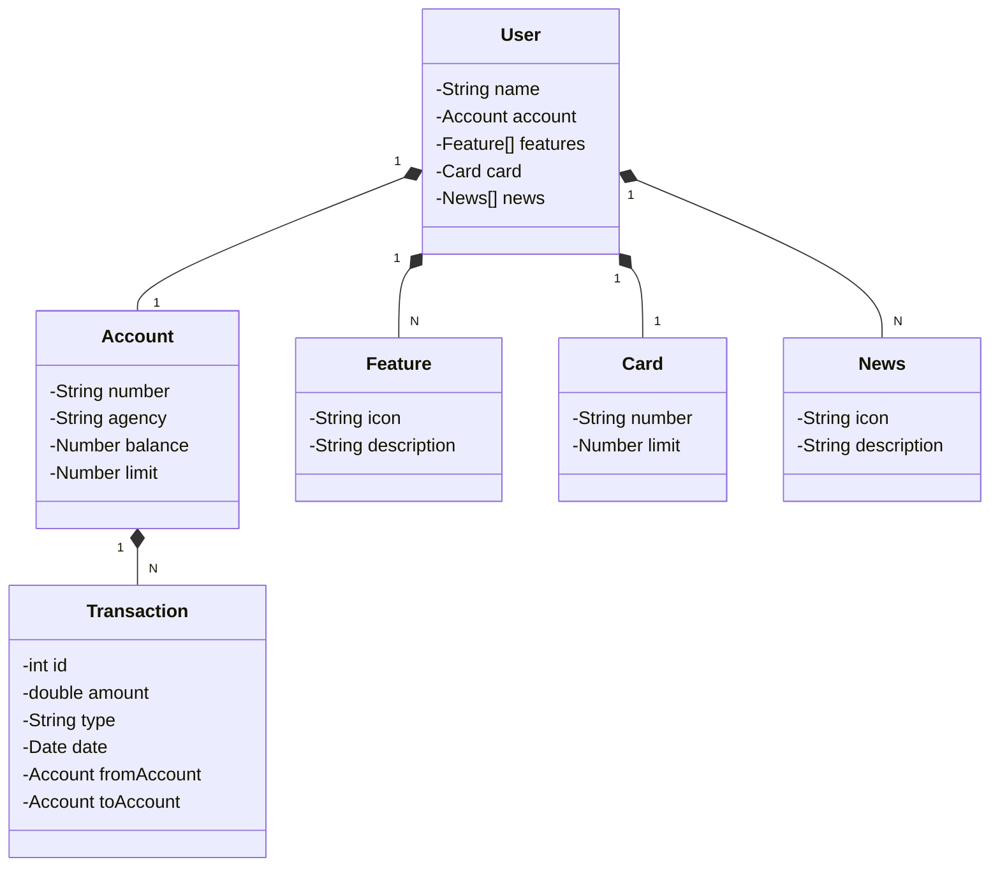

# Santander Dev Week 2023

Java RESTful API criada para a Santander Dev Week.

## Principais Tecnologias
 - **Java 17**: Utilizaremos a versão LTS mais recente do Java para tirar vantagem das últimas inovações que essa linguagem robusta e amplamente utilizada oferece;
 - **Spring Boot 3**: Trabalharemos com a mais nova versão do Spring Boot, que maximiza a produtividade do desenvolvedor por meio de sua poderosa premissa de autoconfiguração;
 - **Spring Data JPA**: Exploraremos como essa ferramenta pode simplificar nossa camada de acesso aos dados, facilitando a integração com bancos de dados SQL;
 - **OpenAPI (Swagger)**: Vamos criar uma documentação de API eficaz e fácil de entender usando a OpenAPI (Swagger), perfeitamente alinhada com a alta produtividade que o Spring Boot oferece;
 - **Railway**: facilita o deploy e monitoramento de nossas soluções na nuvem, além de oferecer diversos bancos de dados como serviço e pipelines de CI/CD.

## [Link do Figma](https://www.figma.com/file/0ZsjwjsYlYd3timxqMWlbj/SANTANDER---Projeto-Web%2FMobile?type=design&node-id=1421%3A432&mode=design&t=6dPQuerScEQH0zAn-1)

O Figma foi utilizado para a abstração do domínio desta API, sendo útil na análise e projeto da solução.

## Diagrama de Classes (Domínio da API)

## FUNCIONALIDADE ADICIONADA 

**Transações Bancárias**

  Adicionamos uma nova funcionalidade para gerenciar transações bancárias, permitindo depósitos, retiradas e transferências entre contas.

  - **Classe Transaction**: Representa uma transação bancária, contendo informações como ID, valor, tipo (DEPÓSITO, RETIRADA, TRANSFERÊNCIA), data, conta de origem e conta de destino.
  - **UserService**: Atualizado para incluir métodos de realização de transações.
  - **UserController**: Adicionados novos endpoints para iniciar transações.

**Endpoints de Transações**
- **POST /users/transaction**:Realiza uma nova transação. Exemplo de corpo da requisição:
  
{
  "amount": 100.0,
  "type": "DEPOSIT",
  "fromAccount": null,
  "toAccount": {
    "number": "123456",
    "agency": "0001",
    "balance": 1000.0,
    "limit": 500.0
  }
}

## IMPORTANTE

Este projeto foi construído com um viés totalmente educacional para a DIO.
